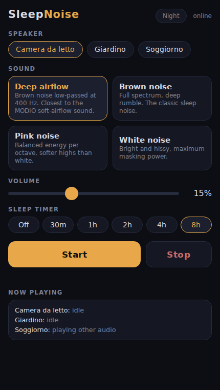
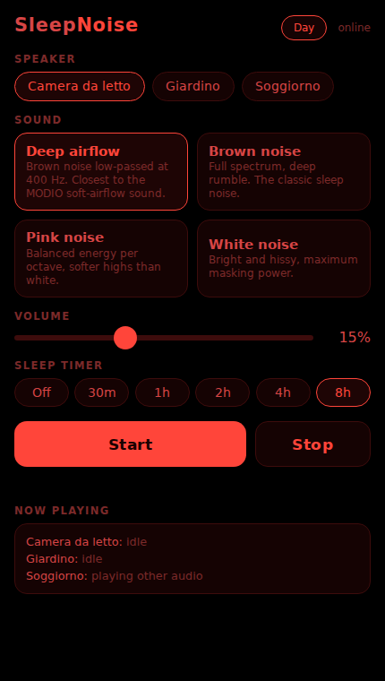

# SleepNoise

Continuous noise streaming and control for Sonos speakers, inspired by the [MODIO](https://www.modio.audio/) guestroom sound masking device. Self-hosted Docker Compose stack: an ffmpeg generator produces endless, gapless noise streams, Icecast serves them over HTTP, and a small web app controls the Sonos speakers directly over UPnP. The phone (or Home Assistant) only sends the trigger; the speaker pulls the stream from this server, so nothing depends on a phone staying awake or on the network.

```
iPhone shortcut / web UI / HA ──POST──> SleepNoise API (8011) ──UPnP──> Sonos
                                                                          │ pulls stream
                                              Icecast (8010) <────HTTP────┘
                                                   ▲
                                            ffmpeg noise generator
```

## Streams

| Mount | Sound | Character |
|-------|-------|-----------|
| `/deep.mp3` | Deep airflow | Brown low-passed at 400 Hz, closest to the MODIO "soft airflow" (default) |
| `/brown.mp3` | Brown noise | Full spectrum, -6 dB/octave, deep rumble |
| `/pink.mp3` | Pink noise | Balanced energy per octave, softer highs |
| `/white.mp3` | White noise | Bright, maximum masking power |

All MP3 192 kbps, 48 kHz, infinite (no loop point, no fades). Stereo channels use independent noise generators (different seeds) for a natural, decorrelated image. Base URL: `http://192.168.1.10:8010`.

## Services

- `sleepnoise-icecast` (port 8010): stream server, status page at `/`
- `sleepnoise-gen`: ffmpeg generator pushing the four mounts to Icecast
- `sleepnoise-app` (port 8011, host network for Sonos multicast discovery): web UI + REST API, talks to Sonos via [SoCo](https://github.com/SoCo/SoCo)

```bash
docker compose up -d --build
```

Configuration in `.env`: ports, Icecast passwords, `DEFAULT_ROOM` (Sonos room name used when API calls omit the speaker), `MAX_VOLUME` (safety cap, default 40%), `SONOS_IPS` (optional comma-separated IPs to skip multicast discovery).

## Web UI

 

`https://sleepnoise.example.com/` - dark, phone-friendly control panel: pick speaker, sound, volume, sleep timer, Start/Stop. Shows live playback state and remaining timer. The timer uses the native Sonos sleep timer, so it survives app restarts and is visible in the Sonos app too.

## API

```bash
# status: speakers, playback state, timer, available sounds
curl https://sleepnoise.example.com/api/status

# start (all fields optional except none; speaker falls back to DEFAULT_ROOM)
curl -X POST https://sleepnoise.example.com/api/play \
  -H 'Content-Type: application/json' \
  -d '{"speaker": "Bedroom", "sound": "deep", "volume": 15, "timer_minutes": 480}'

# stop (also cancels the sleep timer)
curl -X POST https://sleepnoise.example.com/api/stop \
  -H 'Content-Type: application/json' -d '{"speaker": "Bedroom"}'

# adjust timer / volume on the fly
curl -X POST https://sleepnoise.example.com/api/timer \
  -H 'Content-Type: application/json' -d '{"speaker": "Bedroom", "minutes": 60}'
curl -X POST https://sleepnoise.example.com/api/volume \
  -H 'Content-Type: application/json' -d '{"speaker": "Bedroom", "volume": 12}'

# force re-discovery of speakers
curl -X POST https://sleepnoise.example.com/api/discover
```

If the target speaker is in a Sonos group, playback starts on the group coordinator (the whole group plays).

## iOS Shortcut

Shortcuts app > new shortcut > "Get Contents of URL":

- URL: `https://sleepnoise.example.com/api/play`
- Method: POST
- Request Body: JSON, e.g. `{"sound": "deep", "volume": 15, "timer_minutes": 480}` (`sound` defaults to `deep` if omitted)

Name it "Sleep noise": it becomes a Siri phrase, a home-screen icon, a widget, or an Action Button binding. Make a second one for `/api/stop`. With `DEFAULT_ROOM` set in `.env` the shortcut does not need to name the speaker. Works while the phone is on the home Wi-Fi (or on VPN into it).

## Home Assistant (optional)

HA is not in the streaming or control path; it just forwards to the same API. Copy `homeassistant/sleepnoise.yaml` into your HA packages (instructions in the file header). Provides `rest_command.sleepnoise_play` / `sleepnoise_stop`, wrapper scripts, and two local-only webhooks for automations (bedtime routines, "goodnight" scenes, dashboards).

## Why not AirPlay

- Sonos plays Icecast/HTTP MP3 streams natively; the speaker pulls the stream itself.
- AirPlay needs a sender awake all night; if it sleeps or leaves the network, audio stops.
- A live stream has no loop boundary, so no audible gap or fade - one of the selling points of dedicated devices like MODIO.

## What the science says

Short version: sound masking has a plausible, measured mechanism (raising the background level reduces the *change* in noise that causes arousals), but overall evidence that continuous noise improves sleep is still weak. It works best when the real problem is intermittent environmental noise, which is exactly the MODIO/hotel use case.

- Stanchina et al. 2005 ([Sleep Medicine](https://www.sciencedirect.com/science/article/abs/pii/S1389945704002242)): polysomnography with recorded ICU noise. White noise increased arousal thresholds by reducing the difference between background and peak noise; the *delta* between baseline and peak, not the peak itself, is what disrupts sleep. This is the mechanism MODIO-style masking exploits.
- Riedy et al. 2021 ([Sleep Medicine Reviews](https://www.sciencedirect.com/science/article/abs/pii/S1087079220301283)): systematic review of 38 studies on continuous broadband noise as a sleep aid. Rated the quality of evidence as very low. Masking helps against external noise, but noise in a quiet room may add noise-induced sleep fragmentation.
- Papalambros et al. 2017 ([Frontiers in Human Neuroscience](https://www.frontiersin.org/articles/10.3389/fnhum.2017.00109/full)): pink noise *pulses* phase-locked to slow oscillations enhanced deep sleep and memory in older adults; closed-loop stimulation, not continuous masking, and often misquoted as "pink noise improves sleep".
- A 2024 crossover lab study in [SLEEP](https://academic.oup.com/sleep/advance-article/doi/10.1093/sleep/zsag001/8452884) supports pink noise and earplugs against intermittent environmental noise, the masking scenario.
- Brown noise specifically has almost no dedicated RCTs; choosing brown over white/pink is about spectral comfort (energy concentrated at low frequencies, less harsh highs), not stronger evidence.

Practical takeaways applied here: keep the level low (masking works at modest levels; louder is not better, hence the `MAX_VOLUME` cap), prefer a spectrum without harsh highs (brown, or the `deep` mount), and use the sleep timer if noise is only needed for falling asleep.
